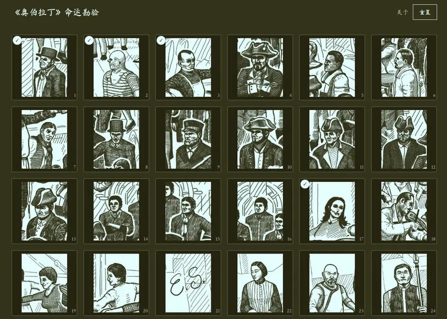
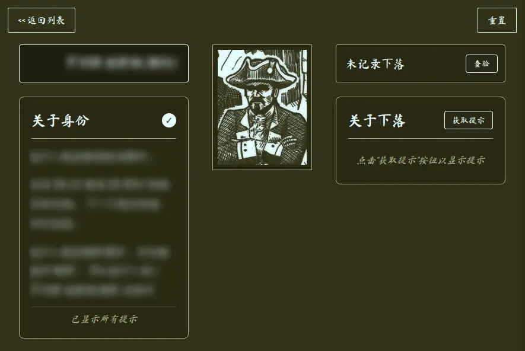

# 《奥伯拉丁》命运勘验

> *Return of the Obra Dinn* — 循序渐进的提示与真相查验工具

这是一个帮助玩家游玩《奥伯拉丁的回归》的工具。它支持玩家获取提示并查证自己的答案。

本项目是 [ObraDinn-HintsAndCheck](https://github.com/Yide-Zhang/ObraDinn-HintsAndCheck) 的重构版本，使用 **Astro** + **Tailwind CSS** 构建，支持 **PWA** 离线访问。

## 功能

- **逐步提示** — 点击「获取提示」逐条解锁身份/下落线索，避免一次性剧透。
- **交互式查验** — 从船员列表和死因选择器中作出选择，即时验证答案。
- **进度保存** — 所有状态存储在浏览器 LocalStorage，刷新不丢失。
- **一键重置** — 支持清空全部进度重新开始。
- **PWA 支持** — 可安装到桌面或移动设备，支持离线访问。

## 预览





## 开发

### 前置条件

- [Node.js](https://nodejs.org/) >= 18
- [pnpm](https://pnpm.io/)（推荐）或 npm

### 安装依赖

```bash
pnpm install
```

### 启动开发服务器

```bash
pnpm run dev
```

访问 <http://localhost:4321> 。

### 构建生产版本

```bash
pnpm run build
```

产物位于 `dist/` 目录。

### 本地预览

```bash
pnpm run preview
```

## 部署

本项目为纯静态站点 (SSG)。构建后的 `dist/` 目录可直接部署到 GitHub Pages、Vercel、Netlify 等任意静态托管服务。

默认 `base` 路径为 `/ObraDinn-Ledger`，如需修改请编辑 `astro.config.mjs` 中的 `BASE_PATH` 变量。

## 工具脚本

### PNG 转 WebP

```bash
node scripts/convert-to-webp.js
```

需要系统安装 [cwebp](https://developers.google.com/speed/webp/download)。该脚本会批量转换 `public/FacesHi/` 中的 PNG 图片并更新对应 JSON 数据文件。

## 致谢

- 原项目：[Yide-Zhang/ObraDinn-HintsAndCheck](https://github.com/Yide-Zhang/ObraDinn-HintsAndCheck)
- 字体：[IM Fell English / Crimson Text](https://fonts.google.com/)、[Ma Shan Zheng](https://fonts.google.com/specimen/Ma+Shan+Zheng)

## 声明

本项目仅供学习交流使用，游戏资源版权归原作者所有。
